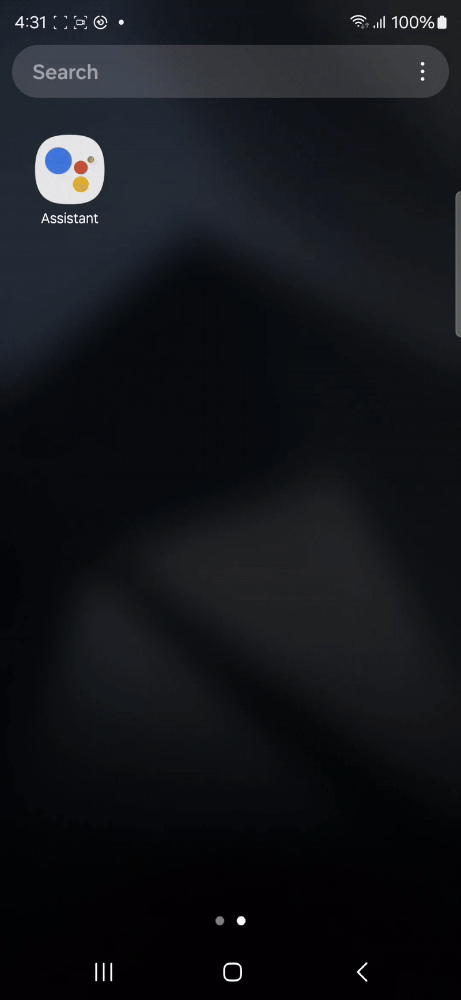

<p align="center">
<picture>
  <source media="(prefers-color-scheme: dark)" srcset="resources/verisoul-logo-dark.svg">
  <source media="(prefers-color-scheme: light)" srcset="resources/verisoul-logo-light.svg">
  
</picture>
</p>

# Native Sample Application



<h2>Quick Start</h2>

<h3>1. Add Repository</h3>

Add these lines to your `settings.gradle` file.

```kotlin
dependencyResolutionManagement {
    repositories {
        ...
        maven { url = uri("https://us-central1-maven.pkg.dev/verisoul/android") }
    }
}
```

<h3>2. Add Dependency</h3>

Add these lines to your `build.gradle` file.

<h4>For Groovy DSL</h4>

```kotlin
dependencies {
  ...
  implementation "ai.verisoul:android:1.0.3"
}
```

<h4>For Kotlin DSL</h4>

```kotlin
dependencies {
  ...
  implementation(libs.verisoul.android)
}
```

Add these lines to your `libs.versions.toml` file.

Under the `[versions]` add:

```kotlin
verisoul = "1.0.3"
```

Under the `[libraries]` add:

```kotlin
verisoul-android = { group = "ai.verisoul", name = "android", version.ref = "verisoul" }
```

<h2>Usage</h2>

<h3>1. Initialization</h3>

Initialization should be called in overridden `onCreate()` function from `Application` class that should be defined in the `AndroidManifest.xml` file. For example:

**Application** class

```kotlin
class SampleApplication : Application() {

    override fun onCreate() {
        super.onCreate()

        Verisoul.init(
            this,
            "<VERISOUL_ENV>",
            "<VERISOUL_PROJECT_ID>"
        )
    }
}
```

**AndroidManifest.xml**

```xml
<manifest>
    <application
        android:name=".SampleApplication">
            ...
    </application>
</manifest>
```

When this is called Verisoul library will be initialized, initial data together with **session ID** will be gathered and uploaded to Verisoul backend. Session ID represent unique identifier of users device in Versioul world.

<h3>2. Fetching Session ID</h3>

Session ID should be successfully fetched nad persisted on Verisoul ecosystem during the initialization of the library. Other than that, Session ID should be persisted to clients backend system to easily track and find which user it belongs. Client's application that is using Verisoul library can obtain session Id by providing the callback as shown below (if some error occur, exception will be thrown with appropriate message):

```kotlin
Verisoul.getSessionId(
    callback = object : VerisoulSessionCallback {
        override fun onSuccess(sessionId: String) {
            // Upload session ID to backend
        }

        override fun onFailure(exception: Exception) {
            // Handle exception
        }
    }
)
```

<h3>3. Provide Touch Events</h3>

In order to gather touch events and compare them to device accelerometer sensor data, clients app should provide touch events to the Versioul library. Easiest way to achieve this is to create `BaseActivity`, to override `dispatchTouchEvent` function and pass the data to Verisoul like shown below.

```kotlin
open class BaseActivity : Activity() {

    override fun dispatchTouchEvent(event: MotionEvent?): Boolean {
        Verisoul.onTouchEvent(event)
        return super.dispatchTouchEvent(event)
    }

    // Other common BaseActivity code...
}
```

In clients application, just use BaseActivity as an Activity base class.

```kotlin
class MainActivity : BaseActivity() {

    // Other Activity code...
}
```
